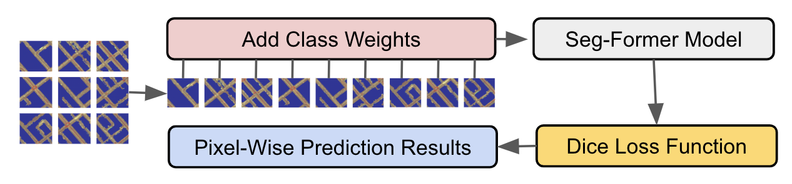
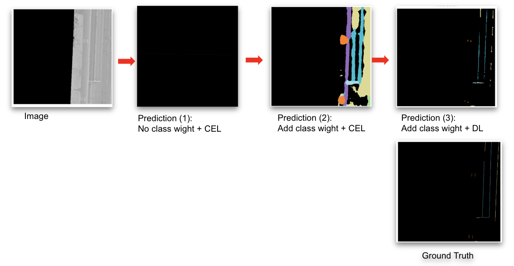

# Road Marking Classification

This project focuses on pixel-level segmentation and classification of road markings using deep learning models such as **SegFormer** for semantic segmentation and classification. The dataset is derived from high-resolution TIFF images and corresponding SHP labels.

## Models Used

**SegFormer (from HuggingFace)**, which is a segmented and transformer-based model for pixel-level segmentation and classification

## Fine-tune Process 

- **Input**: Segmented Pavement Image
- **Output**: Pixel-level probability

## Training Highlights

- **Patch-based design** to capture fine details and spatial context in large images
- **Class weighting** to mitigate class imbalance
- **Dice loss** to enhance fine-detail structures

## Result

**Our fine-tuned model (Prediction 3) shows progressive improvement through training strategies**:
- Prediction (1): road markings largely missed.
- Prediction (2): better class recognition, but poor edge precision.
- Prediction (3): detailed and accurate predictions resembling the ground truth.
